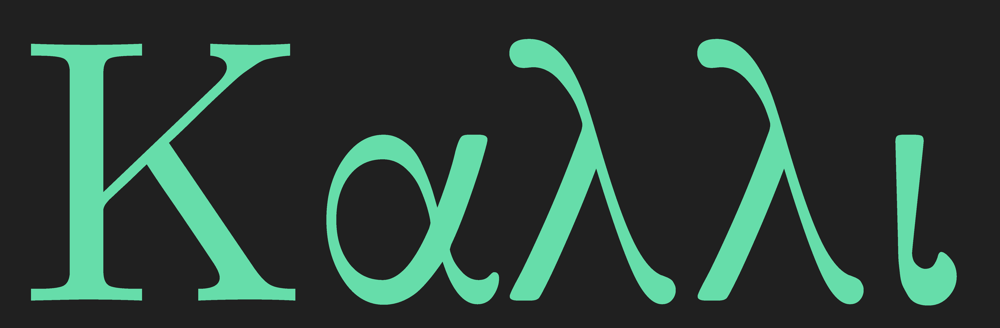

# cali

A calligraphic library for fonts



# Library usage

Load a font from a ttf file:
```f90
	use cali_m
	type(ttf_t)  :: ttf, ttfi
	ttf  = read_ttf('./fonts/computer-modern/cmunrm.ttf')  ! roman
```

Set the foreground and background colors, e.g. using `z'RRGGBBAA'` format:
```f90
	integer(kind = 4) :: fg, bg
	! [... other declarations and code omitted]
	fg  = new_color(int(z'000000ff',8))
	bg  = new_color(int(z'e8e6cbff',8))
```

Set the resolution, line spacing, and margin:
```f90
	double precision :: pixels_per_em
	integer :: line_height, left_margin
	! [...]
	pixels_per_em = 100.d0
	line_height   = nint(1.2 * pixels_per_em)
	left_margin   = 20
```

Make a canvas of pixels with a width, height, and background color:
```f90
	integer(kind = 4), allocatable :: canvas(:,:)
	! [...]
	canvas = new_canvas(700, 400, bg)
```

Draw some strings of text on the canvas:
```f90
	call draw_str(canvas, fg , ttf , "Hello, world!", &
		left_margin, 1 * line_height, pixels_per_em)

	call draw_str(canvas, fg2, ttfi, "foo, bar, baz", &
		left_margin, 2 * line_height, pixels_per_em)
```

Strings must be encoded in UTF-8.  If you have a UTF-32 string, there is a helper function `to_utf8(str32)` that you can use to convert it.  UTF-16 is not supported.

Here, the _x_ position of the text is at the left margin, and the _y_ position is at multiples of the line height.  You can mix and match different fonts (e.g. regular and _italic_) and styles within the same canvas by changing these arguments for each typeset string.

At this point, you can do whatever you want with the pixel canvas.  For example, export the canvas to a ppm image file:
```f90
	call write_img(canvas, 'my-file.ppm')
```

Theoretically you could display the canvas through a graphics library like SDL, OpenGL, or others if you have a Fortran interface for that.

A whole program could look like this:

```f90
program main

	use cali_m

	implicit none

	double precision :: pixels_per_em

	integer :: line_height, left_margin
	integer(kind = 4) :: fg, fg2, bg
	integer(kind = 4), allocatable :: canvas(:,:)

	type(ttf_t)  :: ttf, ttfi

	ttf  = read_ttf('./fonts/computer-modern/cmunrm.ttf')  ! roman
	ttfi = read_ttf('./fonts/computer-modern/cmunti.ttf')  ! italic

	! foreground/background colors
	fg  = new_color(int(z'000000ff',8))
	fg2 = new_color(int(z'2a7fffff',8))
	bg  = new_color(int(z'e8e6cbff',8))

	canvas = new_canvas(700, 400, bg)

	pixels_per_em = 100.d0
	line_height   = nint(1.2 * pixels_per_em)
	left_margin   = 20

	call draw_str(canvas, fg , ttf , "Hello, world!", &
		left_margin, 1 * line_height, pixels_per_em)

	call draw_str(canvas, fg2, ttfi, "foo, bar, baz", &
		left_margin, 2 * line_height, pixels_per_em)

	call write_img(canvas, 'my-file.ppm')

end program main
```

# Linking

## Use CMake

Details TBD.  See [CMakeLists.txt](CMakeLists.txt).

# Resources

My YouTube playlist of development streams for this library:  https://youtube.com/playlist?list=PLkNcKcm8wEj62mKiE7yVUFkmClTYpdpCK

Apple documentation on the ttf glyf (glyph) table:  https://developer.apple.com/fonts/TrueType-Reference-Manual/RM06/Chap6glyf.html

Online ttf preview tool:  [fontdrop.info](https://www.fontdrop.info)

Steve Hanov's blog on parsing ttf files in JavaScript:  http://stevehanov.ca/blog/?id=143

Article about on-curve vs off-curve points for TrueType outlines: https://www.truetype-typography.com/ttoutln.htm

Freya Holmér's video on splines: https://www.youtube.com/watch?v=jvPPXbo87ds

UTF-8 transcoding: https://rosettacode.org/wiki/UTF-8_encode_and_decode

